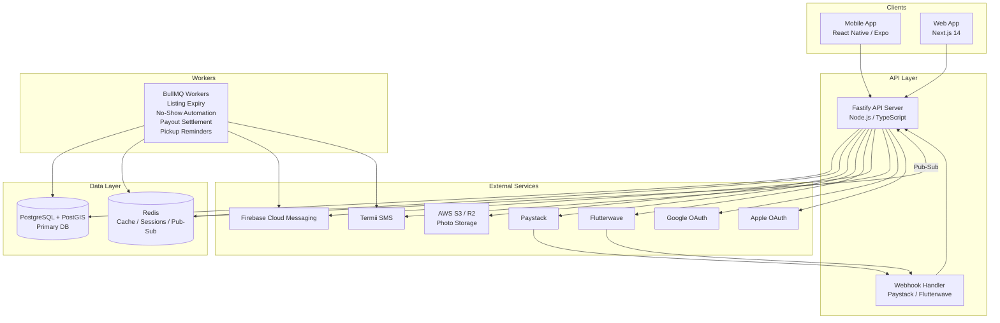
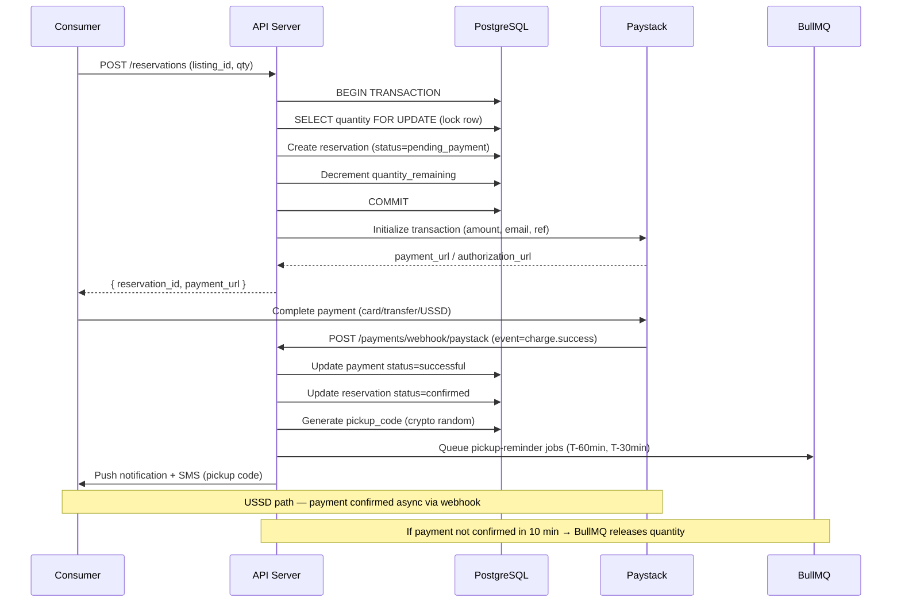

# Design Document

## Overview

ChopSave is a Nigerian food waste rescue marketplace. Food businesses (restaurants, bakeries, bukas, canteens, food stalls, supermarkets, cloud kitchens) list surplus food at 50–75% discount. Consumers discover nearby listings via GPS, reserve and pre-pay digitally, then collect using a pickup code. The platform earns 15–20% commission per transaction, deducted invisibly from the business payout.

**Tech Stack:**
- Mobile: React Native (Expo) — iOS & Android
- Web: Next.js 14 (App Router)
- API: Node.js / TypeScript (Fastify)
- Database: PostgreSQL 15 + PostGIS
- Cache / Pub-Sub: Redis 7
- Job Queue: BullMQ
- Push Notifications: Firebase Cloud Messaging (FCM)
- SMS: Termii (Nigerian OTP delivery)
- File Storage: AWS S3 / Cloudflare R2
- Payments: Paystack (primary) + Flutterwave (fallback)
- CDN: Cloudflare

---

## System Architecture



### Monorepo Structure

```
chopsave/
├── apps/
│   ├── mobile/          # React Native (Expo SDK 51+)
│   ├── web/             # Next.js 14 (App Router)
│   └── api/             # Fastify + TypeScript
├── packages/
│   ├── shared/          # Shared TypeScript types, constants, utilities
│   ├── ui/              # Shared UI component library (React Native Web)
│   └── config/          # Shared ESLint, TS, Prettier configs
├── package.json         # Workspace root (pnpm workspaces)
└── turbo.json           # Turborepo build pipeline
```

---

## Data Models

### users
```sql
CREATE TABLE users (
  id              UUID PRIMARY KEY DEFAULT gen_random_uuid(),
  phone           VARCHAR(15) UNIQUE,
  email           VARCHAR(255) UNIQUE,
  full_name       VARCHAR(255) NOT NULL,
  display_name    VARCHAR(100),
  avatar_url      TEXT,
  role            VARCHAR(20) NOT NULL CHECK (role IN ('consumer', 'business_owner', 'admin')),
  status          VARCHAR(20) NOT NULL DEFAULT 'active'
                  CHECK (status IN ('active', 'suspended', 'deleted')),
  dietary_prefs   TEXT[],
  fcm_token       TEXT,
  notif_prefs     JSONB NOT NULL DEFAULT '{}',
  no_show_count   INTEGER NOT NULL DEFAULT 0,
  no_show_window_start DATE,
  suspended_until TIMESTAMPTZ,
  created_at      TIMESTAMPTZ NOT NULL DEFAULT NOW(),
  updated_at      TIMESTAMPTZ NOT NULL DEFAULT NOW(),
  deleted_at      TIMESTAMPTZ
);

CREATE INDEX idx_users_phone ON users(phone);
CREATE INDEX idx_users_role ON users(role);
CREATE INDEX idx_users_status ON users(status);
```

### businesses
```sql
CREATE TABLE businesses (
  id                UUID PRIMARY KEY DEFAULT gen_random_uuid(),
  user_id           UUID NOT NULL REFERENCES users(id) ON DELETE CASCADE,
  name              VARCHAR(255) NOT NULL,
  type              VARCHAR(50) NOT NULL
                    CHECK (type IN ('restaurant','bakery','buka','canteen','food_stall','supermarket','cloud_kitchen')),
  description       TEXT,
  address           TEXT NOT NULL,
  city              VARCHAR(20) NOT NULL CHECK (city IN ('lagos','abuja')),
  lat               DECIMAL(10,7) NOT NULL,
  lng               DECIMAL(10,7) NOT NULL,
  geom              GEOMETRY(Point, 4326),
  verification_tier VARCHAR(20) NOT NULL DEFAULT 'pending'
                    CHECK (verification_tier IN ('pending','verified_informal','verified_cac','rejected')),
  cac_number        VARCHAR(20),
  photo_urls        TEXT[],
  commission_rate   DECIMAL(4,2) NOT NULL DEFAULT 18.00,
  avg_rating        DECIMAL(3,2) DEFAULT 0.00,
  total_ratings     INTEGER NOT NULL DEFAULT 0,
  food_saved_kg     DECIMAL(10,2) NOT NULL DEFAULT 0.00,
  co2_saved_kg      DECIMAL(10,2) NOT NULL DEFAULT 0.00,
  payout_balance    DECIMAL(12,2) NOT NULL DEFAULT 0.00,
  rejection_reason  TEXT,
  created_at        TIMESTAMPTZ NOT NULL DEFAULT NOW(),
  updated_at        TIMESTAMPTZ NOT NULL DEFAULT NOW()
);

CREATE INDEX idx_businesses_user_id ON businesses(user_id);
CREATE INDEX idx_businesses_geom ON businesses USING GIST(geom);
CREATE INDEX idx_businesses_city ON businesses(city);
CREATE INDEX idx_businesses_verification ON businesses(verification_tier);
```

### listings
```sql
CREATE TABLE listings (
  id              UUID PRIMARY KEY DEFAULT gen_random_uuid(),
  business_id     UUID NOT NULL REFERENCES businesses(id) ON DELETE CASCADE,
  type            VARCHAR(20) NOT NULL CHECK (type IN ('surprise_bag', 'itemised')),
  title           VARCHAR(255),
  description     TEXT,
  status          VARCHAR(20) NOT NULL DEFAULT 'active'
                  CHECK (status IN ('active','paused','sold_out','expired','closed')),
  original_price  DECIMAL(10,2),
  discount_price  DECIMAL(10,2) NOT NULL,
  quantity_total  INTEGER NOT NULL,
  quantity_remaining INTEGER NOT NULL,
  pickup_start    TIMESTAMPTZ NOT NULL,
  pickup_end      TIMESTAMPTZ NOT NULL,
  food_categories TEXT[] NOT NULL DEFAULT '{}',
  dietary_tags    TEXT[] NOT NULL DEFAULT '{}',
  photo_url       TEXT,
  weight_kg       DECIMAL(5,2) DEFAULT 0.50,
  created_at      TIMESTAMPTZ NOT NULL DEFAULT NOW(),
  updated_at      TIMESTAMPTZ NOT NULL DEFAULT NOW(),

  CONSTRAINT listing_pickup_window CHECK (pickup_end > pickup_start),
  CONSTRAINT listing_pickup_same_day CHECK (
    DATE(pickup_start AT TIME ZONE 'Africa/Lagos') = DATE(pickup_end AT TIME ZONE 'Africa/Lagos')
  ),
  CONSTRAINT listing_quantity CHECK (quantity_remaining >= 0 AND quantity_remaining <= quantity_total),
  CONSTRAINT listing_price_positive CHECK (discount_price > 0)
);

CREATE INDEX idx_listings_business_id ON listings(business_id);
CREATE INDEX idx_listings_status ON listings(status);
CREATE INDEX idx_listings_pickup_end ON listings(pickup_end);
CREATE INDEX idx_listings_type ON listings(type);
```

### listing_items
```sql
CREATE TABLE listing_items (
  id              UUID PRIMARY KEY DEFAULT gen_random_uuid(),
  listing_id      UUID NOT NULL REFERENCES listings(id) ON DELETE CASCADE,
  name            VARCHAR(255) NOT NULL,
  description     VARCHAR(200),
  original_price  DECIMAL(10,2),
  discount_price  DECIMAL(10,2) NOT NULL,
  quantity_total  INTEGER NOT NULL,
  quantity_remaining INTEGER NOT NULL,
  dietary_tags    TEXT[] DEFAULT '{}',
  photo_url       TEXT,
  created_at      TIMESTAMPTZ NOT NULL DEFAULT NOW(),
  updated_at      TIMESTAMPTZ NOT NULL DEFAULT NOW(),

  CONSTRAINT item_price_positive CHECK (discount_price > 0),
  CONSTRAINT item_quantity CHECK (quantity_remaining >= 0 AND quantity_remaining <= quantity_total)
);

CREATE INDEX idx_listing_items_listing_id ON listing_items(listing_id);
```

### reservations
```sql
CREATE TABLE reservations (
  id              UUID PRIMARY KEY DEFAULT gen_random_uuid(),
  consumer_id     UUID NOT NULL REFERENCES users(id),
  listing_id      UUID NOT NULL REFERENCES listings(id),
  business_id     UUID NOT NULL REFERENCES businesses(id),
  quantity        INTEGER NOT NULL DEFAULT 1,
  amount_paid     DECIMAL(10,2) NOT NULL,
  commission_rate DECIMAL(4,2) NOT NULL,
  commission_amt  DECIMAL(10,2) NOT NULL,
  payout_amt      DECIMAL(10,2) NOT NULL,
  status          VARCHAR(20) NOT NULL DEFAULT 'pending_payment'
                  CHECK (status IN (
                    'pending_payment','confirmed','ready','completed',
                    'no_show','cancelled','refunded','disputed'
                  )),
  pickup_code     VARCHAR(8) NOT NULL UNIQUE,
  collected_at    TIMESTAMPTZ,
  no_show_at      TIMESTAMPTZ,
  cancelled_at    TIMESTAMPTZ,
  cancel_reason   TEXT,
  created_at      TIMESTAMPTZ NOT NULL DEFAULT NOW(),
  updated_at      TIMESTAMPTZ NOT NULL DEFAULT NOW(),

  CONSTRAINT payout_commission_sum CHECK (
    ABS((payout_amt + commission_amt) - amount_paid) < 0.01
  )
);

CREATE INDEX idx_reservations_consumer_id ON reservations(consumer_id);
CREATE INDEX idx_reservations_listing_id ON reservations(listing_id);
CREATE INDEX idx_reservations_business_id ON reservations(business_id);
CREATE INDEX idx_reservations_status ON reservations(status);
CREATE INDEX idx_reservations_pickup_code ON reservations(pickup_code);
CREATE INDEX idx_reservations_created_at ON reservations(created_at);
```

### reservation_items
```sql
CREATE TABLE reservation_items (
  id              UUID PRIMARY KEY DEFAULT gen_random_uuid(),
  reservation_id  UUID NOT NULL REFERENCES reservations(id) ON DELETE CASCADE,
  listing_item_id UUID NOT NULL REFERENCES listing_items(id),
  quantity        INTEGER NOT NULL,
  unit_price      DECIMAL(10,2) NOT NULL,
  subtotal        DECIMAL(10,2) NOT NULL
);

CREATE INDEX idx_res_items_reservation_id ON reservation_items(reservation_id);
```

### payments
```sql
CREATE TABLE payments (
  id              UUID PRIMARY KEY DEFAULT gen_random_uuid(),
  reservation_id  UUID NOT NULL REFERENCES reservations(id),
  gateway         VARCHAR(20) NOT NULL CHECK (gateway IN ('paystack','flutterwave')),
  method          VARCHAR(20) NOT NULL CHECK (method IN ('card','bank_transfer','ussd','opay','wallet')),
  amount          DECIMAL(10,2) NOT NULL,
  currency        VARCHAR(3) NOT NULL DEFAULT 'NGN',
  status          VARCHAR(20) NOT NULL DEFAULT 'initiated'
                  CHECK (status IN ('initiated','pending','successful','failed','refunded')),
  gateway_ref     VARCHAR(100) UNIQUE,
  gateway_meta    JSONB,
  initiated_at    TIMESTAMPTZ NOT NULL DEFAULT NOW(),
  confirmed_at    TIMESTAMPTZ,
  refunded_at     TIMESTAMPTZ,
  refund_ref      VARCHAR(100)
);

CREATE INDEX idx_payments_reservation_id ON payments(reservation_id);
CREATE INDEX idx_payments_gateway_ref ON payments(gateway_ref);
CREATE INDEX idx_payments_status ON payments(status);
```

### ratings
```sql
CREATE TABLE ratings (
  id              UUID PRIMARY KEY DEFAULT gen_random_uuid(),
  reservation_id  UUID NOT NULL REFERENCES reservations(id),
  rater_id        UUID NOT NULL REFERENCES users(id),
  ratee_id        UUID NOT NULL REFERENCES users(id),
  ratee_type      VARCHAR(20) NOT NULL CHECK (ratee_type IN ('business','consumer')),
  stars           SMALLINT NOT NULL CHECK (stars BETWEEN 1 AND 5),
  review          TEXT,
  flag_tag        VARCHAR(50),
  created_at      TIMESTAMPTZ NOT NULL DEFAULT NOW(),

  UNIQUE (reservation_id, rater_id)
);

CREATE INDEX idx_ratings_ratee_id ON ratings(ratee_id);
CREATE INDEX idx_ratings_reservation_id ON ratings(reservation_id);
```

### favourites
```sql
CREATE TABLE favourites (
  consumer_id     UUID NOT NULL REFERENCES users(id) ON DELETE CASCADE,
  business_id     UUID NOT NULL REFERENCES businesses(id) ON DELETE CASCADE,
  created_at      TIMESTAMPTZ NOT NULL DEFAULT NOW(),
  PRIMARY KEY (consumer_id, business_id)
);

CREATE INDEX idx_favourites_business_id ON favourites(business_id);
```

### notifications
```sql
CREATE TABLE notifications (
  id              UUID PRIMARY KEY DEFAULT gen_random_uuid(),
  user_id         UUID NOT NULL REFERENCES users(id) ON DELETE CASCADE,
  type            VARCHAR(50) NOT NULL,
  title           TEXT NOT NULL,
  body            TEXT NOT NULL,
  payload         JSONB DEFAULT '{}',
  channel         VARCHAR(20) NOT NULL CHECK (channel IN ('push','sms','in_app')),
  read            BOOLEAN NOT NULL DEFAULT FALSE,
  sent_at         TIMESTAMPTZ,
  created_at      TIMESTAMPTZ NOT NULL DEFAULT NOW()
);

CREATE INDEX idx_notifications_user_id ON notifications(user_id);
CREATE INDEX idx_notifications_read ON notifications(read);
CREATE INDEX idx_notifications_created_at ON notifications(created_at DESC);
```

### payouts
```sql
CREATE TABLE payouts (
  id              UUID PRIMARY KEY DEFAULT gen_random_uuid(),
  business_id     UUID NOT NULL REFERENCES businesses(id),
  amount          DECIMAL(10,2) NOT NULL,
  status          VARCHAR(20) NOT NULL DEFAULT 'pending'
                  CHECK (status IN ('pending','processing','completed','failed')),
  bank_account    JSONB NOT NULL,
  gateway         VARCHAR(20) NOT NULL CHECK (gateway IN ('paystack','flutterwave')),
  gateway_ref     VARCHAR(100),
  failure_reason  TEXT,
  requested_at    TIMESTAMPTZ NOT NULL DEFAULT NOW(),
  processed_at    TIMESTAMPTZ,
  completed_at    TIMESTAMPTZ
);

CREATE INDEX idx_payouts_business_id ON payouts(business_id);
CREATE INDEX idx_payouts_status ON payouts(status);
```

### disputes
```sql
CREATE TABLE disputes (
  id              UUID PRIMARY KEY DEFAULT gen_random_uuid(),
  reservation_id  UUID NOT NULL REFERENCES reservations(id),
  raised_by       UUID NOT NULL REFERENCES users(id),
  reason          VARCHAR(50) NOT NULL
                  CHECK (reason IN ('food_quality','food_not_available','incorrect_order','other')),
  description     TEXT,
  status          VARCHAR(20) NOT NULL DEFAULT 'open'
                  CHECK (status IN ('open','under_review','resolved_refund','resolved_no_refund','closed')),
  resolution_note TEXT,
  resolved_by     UUID REFERENCES users(id),
  raised_at       TIMESTAMPTZ NOT NULL DEFAULT NOW(),
  resolved_at     TIMESTAMPTZ
);

CREATE INDEX idx_disputes_reservation_id ON disputes(reservation_id);
CREATE INDEX idx_disputes_status ON disputes(status);
```

### system_config
```sql
CREATE TABLE system_config (
  key             VARCHAR(100) PRIMARY KEY,
  value           TEXT NOT NULL,
  description     TEXT,
  updated_by      UUID REFERENCES users(id),
  updated_at      TIMESTAMPTZ NOT NULL DEFAULT NOW()
);

-- Seed defaults
INSERT INTO system_config(key, value, description) VALUES
  ('default_commission_rate', '18', 'Default platform commission % per transaction'),
  ('food_weight_default_kg', '0.5', 'Default food weight in kg per listing unit'),
  ('co2_per_kg_food', '2.5', 'kg CO2 equivalent per kg of food saved'),
  ('no_show_suspension_days', '7', 'Days buyer is suspended after 3 no-shows in 30 days'),
  ('payout_min_ngn', '500', 'Minimum NGN for payout settlement'),
  ('pickup_reminder_60min', 'true', 'Send reminder 60min before pickup window'),
  ('pickup_reminder_30min', 'true', 'Send reminder 30min before pickup window closes');
```

### admin_actions
```sql
CREATE TABLE admin_actions (
  id              UUID PRIMARY KEY DEFAULT gen_random_uuid(),
  admin_id        UUID NOT NULL REFERENCES users(id),
  action_type     VARCHAR(50) NOT NULL,
  target_type     VARCHAR(30) NOT NULL,
  target_id       UUID NOT NULL,
  reason          TEXT,
  metadata        JSONB DEFAULT '{}',
  created_at      TIMESTAMPTZ NOT NULL DEFAULT NOW()
);

CREATE INDEX idx_admin_actions_admin_id ON admin_actions(admin_id);
CREATE INDEX idx_admin_actions_target ON admin_actions(target_type, target_id);
```

---

## API Design

All endpoints are prefixed with `/api/v1`. Authentication uses Bearer JWT tokens except where noted as `[public]`.

### Auth
| Method | Path | Auth | Description |
|--------|------|------|-------------|
| POST | `/auth/otp/send` | public | Send OTP to phone number |
| POST | `/auth/otp/verify` | public | Verify OTP, return access + refresh tokens |
| POST | `/auth/social` | public | Google/Apple social login, return tokens |
| POST | `/auth/refresh` | public | Refresh access token using refresh token |
| POST | `/auth/logout` | Consumer/Business | Invalidate refresh token |

### Users
| Method | Path | Auth | Description |
|--------|------|------|-------------|
| GET | `/users/me` | Any | Get own profile |
| PATCH | `/users/me` | Any | Update display name, avatar, dietary prefs |
| DELETE | `/users/me` | Any | Soft-delete and anonymise account |
| PATCH | `/users/me/notifications` | Any | Update notification preferences |

### Businesses
| Method | Path | Auth | Description |
|--------|------|------|-------------|
| POST | `/businesses/register` | Business | Submit business registration |
| GET | `/businesses/:id` | public | Get business profile and active listings |
| GET | `/businesses/:id/stats` | Business (own) | Revenue, food saved, CO₂ stats |
| PATCH | `/businesses/:id` | Business (own) | Update business profile |
| POST | `/businesses/:id/bank-accounts` | Business (own) | Add bank account for payouts |
| GET | `/businesses/:id/bank-accounts` | Business (own) | List registered bank accounts |

### Listings
| Method | Path | Auth | Description |
|--------|------|------|-------------|
| GET | `/listings/nearby` | Consumer | Geospatial search — `?lat&lng&radius&filters` |
| GET | `/listings/:id` | public | Get listing detail with items |
| POST | `/listings` | Business | Create surprise bag or itemised listing |
| PATCH | `/listings/:id` | Business (own) | Edit listing (title, qty, pickup window) |
| PATCH | `/listings/:id/status` | Business (own) | Pause, resume, close |
| DELETE | `/listings/:id` | Business (own) | Delete listing (no active reservations) |
| POST | `/listings/:id/items` | Business (own) | Add item to itemised listing |
| PATCH | `/listings/:id/items/:itemId` | Business (own) | Update listing item |
| DELETE | `/listings/:id/items/:itemId` | Business (own) | Remove listing item |

### Reservations
| Method | Path | Auth | Description |
|--------|------|------|-------------|
| POST | `/reservations` | Consumer | Create reservation (initiates payment hold) |
| GET | `/reservations` | Consumer | List own reservations |
| GET | `/reservations/:id` | Consumer/Business | Get reservation detail |
| POST | `/reservations/:id/collect` | Business (own) | Confirm pickup by validating code |
| POST | `/reservations/:id/cancel` | Consumer | Cancel (refund if > 1hr before pickup) |
| POST | `/reservations/:id/dispute` | Consumer | Raise dispute |

### Payments
| Method | Path | Auth | Description |
|--------|------|------|-------------|
| POST | `/payments/initiate` | Consumer | Initiate payment for pending reservation |
| POST | `/payments/webhook/paystack` | public (signed) | Paystack webhook receiver |
| POST | `/payments/webhook/flutterwave` | public (signed) | Flutterwave webhook receiver |

### Ratings
| Method | Path | Auth | Description |
|--------|------|------|-------------|
| POST | `/ratings` | Consumer/Business | Submit rating after pickup |
| GET | `/businesses/:id/ratings` | public | List business ratings (paginated) |

### Favourites
| Method | Path | Auth | Description |
|--------|------|------|-------------|
| GET | `/favourites` | Consumer | List favourited businesses |
| POST | `/favourites/:businessId` | Consumer | Add business to favourites |
| DELETE | `/favourites/:businessId` | Consumer | Remove from favourites |

### Notifications
| Method | Path | Auth | Description |
|--------|------|------|-------------|
| GET | `/notifications` | Any | List user's notifications |
| PATCH | `/notifications/:id/read` | Any | Mark notification as read |
| PATCH | `/notifications/read-all` | Any | Mark all as read |

### Payouts
| Method | Path | Auth | Description |
|--------|------|------|-------------|
| POST | `/payouts/request` | Business | Request payout to bank account |
| GET | `/payouts/history` | Business | List payout transactions |

### Business Orders
| Method | Path | Auth | Description |
|--------|------|------|-------------|
| GET | `/business/orders` | Business | Today's reservations (real-time) |
| PATCH | `/business/orders/:id/ready` | Business | Mark order as ready for pickup |

### Admin
| Method | Path | Auth | Description |
|--------|------|------|-------------|
| GET | `/admin/businesses/pending` | Admin | List pending verification businesses |
| POST | `/admin/businesses/:id/approve` | Admin | Approve business registration |
| POST | `/admin/businesses/:id/reject` | Admin | Reject with reason |
| GET | `/admin/analytics` | Admin | Platform-wide metrics |
| GET | `/admin/disputes` | Admin | List open disputes |
| POST | `/admin/disputes/:id/resolve` | Admin | Resolve dispute (refund/no-refund) |
| POST | `/admin/users/:id/suspend` | Admin | Suspend user account |
| POST | `/admin/users/:id/ban` | Admin | Permanently ban user |
| GET | `/admin/config` | Admin | View system config |
| PATCH | `/admin/config/:key` | Admin | Update system config value |

---

## Geospatial Design

### PostGIS Setup
```sql
CREATE EXTENSION IF NOT EXISTS postgis;

-- businesses.geom is populated via trigger on insert/update of lat/lng
CREATE OR REPLACE FUNCTION update_business_geom()
RETURNS TRIGGER AS $$
BEGIN
  NEW.geom = ST_SetSRID(ST_MakePoint(NEW.lng, NEW.lat), 4326);
  RETURN NEW;
END;
$$ LANGUAGE plpgsql;

CREATE TRIGGER trg_update_business_geom
  BEFORE INSERT OR UPDATE OF lat, lng ON businesses
  FOR EACH ROW EXECUTE FUNCTION update_business_geom();
```

### Nearby Listings Query
```sql
-- Get active listings within :radius_metres of (:lng, :lat)
-- filtered to Lagos or Abuja geofence
SELECT
  l.*,
  b.name AS business_name,
  b.avg_rating,
  b.verification_tier,
  ST_Distance(
    b.geom::geography,
    ST_SetSRID(ST_MakePoint(:lng, :lat), 4326)::geography
  ) AS distance_metres
FROM listings l
JOIN businesses b ON b.id = l.business_id
WHERE
  l.status = 'active'
  AND l.pickup_end > NOW()
  AND l.quantity_remaining > 0
  AND ST_DWithin(
    b.geom::geography,
    ST_SetSRID(ST_MakePoint(:lng, :lat), 4326)::geography,
    :radius_metres
  )
  AND ST_Within(
    b.geom,
    (SELECT geom FROM city_geofences WHERE city = :city)
  )
ORDER BY distance_metres ASC;
```

### Lagos & Abuja Geofences
```sql
CREATE TABLE city_geofences (
  city  VARCHAR(20) PRIMARY KEY,
  geom  GEOMETRY(Polygon, 4326)
);

-- Lagos State approximate bounding polygon
INSERT INTO city_geofences(city, geom) VALUES (
  'lagos',
  ST_GeomFromText('POLYGON((2.7 6.3, 3.7 6.3, 3.7 6.8, 2.7 6.8, 2.7 6.3))', 4326)
);

-- FCT Abuja approximate bounding polygon
INSERT INTO city_geofences(city, geom) VALUES (
  'abuja',
  ST_GeomFromText('POLYGON((6.9 8.8, 7.3 8.8, 7.3 9.1, 6.9 9.1, 6.9 8.8))', 4326)
);
```

---

## Payment & Commission Flow



### Commission Calculation
```typescript
const commissionRate = business.commission_rate / 100; // e.g. 0.18
const commissionAmt = roundToKobo(amountPaid * commissionRate);
const payoutAmt = amountPaid - commissionAmt;
// Invariant: payoutAmt + commissionAmt === amountPaid (within ±1 kobo rounding)
```

### Refund Flow
- Business cancels listing → API calls Paystack/Flutterwave refund endpoint for each reservation
- Dispute resolved in buyer's favour → Admin triggers refund via `/admin/disputes/:id/resolve`
- Refund status tracked in `payments.status = 'refunded'`

### Daily Payout Settlement (BullMQ Job)
```
Every business day at 10:00 WAT:
1. SELECT businesses WHERE payout_balance >= 500
2. For each business, call Paystack Transfer API
3. Update payout record status
4. Notify business via push + SMS
```

---

## Real-Time Updates

### Server-Sent Events (SSE)

Consumers subscribe to a per-city SSE stream for live listing updates:

```
GET /sse/listings?city=lagos
```

Events emitted:
- `listing.created` — new listing published
- `listing.sold_out` — quantity hit zero
- `listing.expired` — pickup window ended
- `listing.quantity_update` — quantity decremented

### Redis Pub/Sub
BullMQ workers publish events to Redis channels after completing jobs:
- `channel:listings:lagos` / `channel:listings:abuja`
- SSE handler subscribes and forwards to connected clients

---

## Notification System

### Notification Types
```typescript
enum NotificationType {
  RESERVATION_CONFIRMED = 'reservation_confirmed',
  PICKUP_REMINDER_60 = 'pickup_reminder_60min',
  PICKUP_REMINDER_30 = 'pickup_reminder_30min',
  ORDER_READY = 'order_ready',
  ORDER_COLLECTED = 'order_collected',
  NO_SHOW = 'no_show',
  NEW_LISTING_NEARBY = 'new_listing_nearby',
  NEW_LISTING_FAVOURITE = 'new_listing_favourite',
  BUSINESS_APPROVED = 'business_approved',
  BUSINESS_REJECTED = 'business_rejected',
  PAYOUT_PROCESSED = 'payout_processed',
  PAYOUT_FAILED = 'payout_failed',
  REFUND_INITIATED = 'refund_initiated',
  LISTING_CANCELLED = 'listing_cancelled',
  DISPUTE_OPENED = 'dispute_opened',
  DISPUTE_RESOLVED = 'dispute_resolved',
  ACCOUNT_SUSPENDED = 'account_suspended',
}
```

### Delivery Strategy
1. Check `users.notif_prefs` for user's preference for this notification type
2. If push enabled + FCM token present → send via FCM
3. If push disabled or FCM fails → fall back to Termii SMS (critical types only)
4. Always write to `notifications` table for in-app inbox

### Scheduled Notification Jobs
```typescript
// When reservation is confirmed, queue time-based reminders
await pickupReminderQueue.add('reminder-60min', { reservationId }, {
  delay: pickupStart.getTime() - Date.now() - 60 * 60 * 1000,
});
await pickupReminderQueue.add('reminder-30min', { reservationId }, {
  delay: pickupEnd.getTime() - Date.now() - 30 * 60 * 1000,
});
```

---

## Background Jobs (BullMQ)

| Queue | Schedule | Description |
|-------|----------|-------------|
| `listing-expiry` | Every 60s | Set listings to `expired` where `pickup_end < NOW()` |
| `no-show-automation` | Every 60s | Mark reservations as `no_show` where `pickup_end < NOW()` AND `status = 'confirmed'` |
| `payout-settlement` | Daily 10:00 WAT | Transfer payout balances ≥ ₦500 to business bank accounts |
| `pickup-reminder` | Delayed (per reservation) | Send T-60min and T-30min pickup reminders |
| `notification-dispatch` | Immediate | Async FCM / SMS dispatch |
| `pending-payment-expiry` | Every 60s | Release quantity for reservations in `pending_payment` > 10 minutes |
| `no-show-suspension-check` | Daily | Suspend buyers with ≥3 no-shows in 30 days |

---

## Security Design

### Authentication
```
POST /auth/otp/send → Redis stores OTP hash (TTL 5min) keyed by phone
POST /auth/otp/verify → validates OTP, returns:
  - accessToken: JWT (RS256, 15min expiry)
  - refreshToken: opaque token stored in DB (30-day expiry)
PATCH /auth/refresh → exchanges refreshToken for new accessToken
```

### OTP Rate Limiting (Redis)
```
Key: otp_rate:{phone}
Value: count
TTL: 3600s (1 hour)
Max: 5 attempts — if exceeded, return HTTP 429
```

### RBAC Middleware
```typescript
// Role guard applied per route
requireRole('admin')     // Admin-only
requireRole('business')  // Business owner of that resource
requireRole('consumer')  // Authenticated consumer
```

### Payment Security
- Never store card numbers, CVV, or bank PINs
- All card data tokenised by Paystack/Flutterwave
- Webhook signatures verified using HMAC-SHA512 (Paystack) / SHA256 (Flutterwave)

### NDPR Compliance
- Account deletion: anonymise PII within 30 days (name → "Deleted User", phone → null, email → null)
- Retain transaction records for 7 years (financial compliance)
- GPS location data: not persisted beyond the request lifecycle

---

## Pickup Code System

### Code Generation
```typescript
import { randomBytes } from 'crypto';

function generatePickupCode(): string {
  const chars = 'ABCDEFGHJKLMNPQRSTUVWXYZ23456789'; // unambiguous chars
  const bytes = randomBytes(6);
  return Array.from(bytes)
    .map(b => chars[b % chars.length])
    .join('');
}
// Example: "X7K4MR"
```

### QR Code
- Generated client-side (React Native: `react-native-qrcode-svg`, Web: `qrcode.react`)
- QR encodes the 6-char alphanumeric code (not a URL)
- No server round-trip required for display

### Offline Support
- Reservation data (including pickup_code, business address, pickup_window) cached in AsyncStorage (mobile) / localStorage (web) at confirmation time
- Business owner can enter code manually if camera unavailable

---

## Correctness Properties

These properties must hold at all times and are verified by property-based tests:

### 1. Quantity Invariant
```
For every listing L:
  L.quantity_remaining >= 0
  L.quantity_remaining <= L.quantity_total
  SUM(r.quantity WHERE r.listing_id = L.id AND r.status IN ('confirmed','ready','completed'))
    <= L.quantity_total
```

### 2. Commission Invariant
```
For every confirmed reservation R:
  ABS((R.payout_amt + R.commission_amt) - R.amount_paid) < 0.01
  R.commission_amt = ROUND(R.amount_paid * R.commission_rate / 100, 2)
```

### 3. Pickup Code Uniqueness
```
For all pairs of reservations (R1, R2) where R1 != R2
  AND both have status IN ('confirmed','ready'):
    R1.pickup_code != R2.pickup_code
```

### 4. Rating Idempotency
```
For every (reservation_id, rater_id) pair:
  COUNT(ratings WHERE reservation_id = R AND rater_id = U) <= 1
```

### 5. No-Show Automation
```
For every reservation R:
  IF NOW() > (SELECT pickup_end FROM listings WHERE id = R.listing_id)
  AND R.status = 'confirmed'
  THEN R.status must transition to 'no_show' within 2 minutes
```

### 6. Payment Consistency
```
For every reservation R with status IN ('confirmed','ready','completed'):
  EXISTS exactly one payment P WHERE P.reservation_id = R.id AND P.status = 'successful'
```

---

## Component Architecture

### API Layer (Fastify + TypeScript)

```
api/src/
├── plugins/
│   ├── auth.ts           # JWT verification, session middleware
│   ├── database.ts       # PostgreSQL pool (pg), PostGIS
│   ├── redis.ts          # Redis client (ioredis)
│   └── queue.ts          # BullMQ queue setup
├── routes/
│   ├── auth/
│   ├── users/
│   ├── businesses/
│   ├── listings/
│   ├── reservations/
│   ├── payments/
│   ├── ratings/
│   ├── favourites/
│   ├── notifications/
│   ├── payouts/
│   └── admin/
├── workers/
│   ├── listingExpiry.worker.ts
│   ├── noShowAutomation.worker.ts
│   ├── payoutSettlement.worker.ts
│   ├── pickupReminder.worker.ts
│   └── notificationDispatch.worker.ts
├── services/
│   ├── PaymentService.ts
│   ├── NotificationService.ts
│   ├── GeofenceService.ts
│   ├── PickupCodeService.ts
│   └── ImpactStatsService.ts
└── lib/
    ├── paystack.ts
    ├── flutterwave.ts
    ├── fcm.ts
    └── termii.ts
```

### Mobile App (React Native / Expo)

```
mobile/src/
├── screens/
│   ├── auth/
│   ├── consumer/
│   │   ├── Feed/           # Near Me list + map toggle
│   │   ├── ListingDetail/
│   │   ├── Checkout/
│   │   ├── Orders/
│   │   ├── PickupCode/     # QR + alphanumeric display
│   │   ├── Favourites/
│   │   └── Profile/
│   ├── business/
│   │   ├── Dashboard/
│   │   ├── CreateListing/
│   │   ├── ManageListings/
│   │   ├── Orders/         # Scan QR + confirm collection
│   │   ├── Earnings/
│   │   └── Settings/
│   └── admin/              # Web-only (redirect to web admin)
├── components/
├── hooks/
├── store/                  # Zustand state management
├── services/               # API client (axios + react-query)
└── utils/
```

### Web App (Next.js 14)

```
web/src/app/
├── (public)/               # Landing, login, register
├── (consumer)/             # Consumer dashboard
├── (business)/             # Business partner portal
└── admin/                  # Admin dashboard (server components)
```
